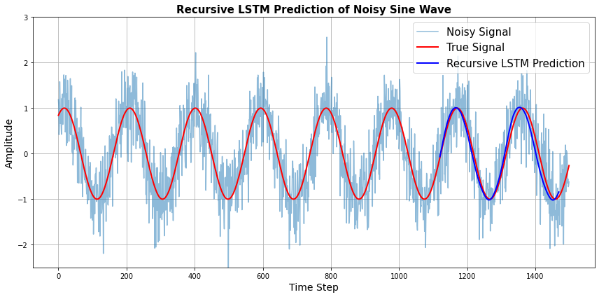

# Recursive LSTM Time Series Prediction

This repository demonstrates how to use a Long Short-Term Memory (LSTM) neural network for **recursive prediction** on a noisy sine wave. The LSTM is trained to denoise and forecast future values, making it useful for time series forecasting tasks.

## Overview

- Generate a sine wave with noise
- Preprocess and scale the data
- Train an LSTM model on a windowed dataset
- Recursively predict future values beyond training data
- Visualize the predictions vs. true and noisy signals

## Requirements

- Python 3.7+
- NumPy
- Matplotlib
- TensorFlow/Keras
- scikit-learn

Install them using:
pip install numpy matplotlib scikit-learn tensorflow

## How It Works
Recursive prediction means:
1. The model predicts one step ahead.
2. That prediction is fed back as input to predict the next step.
3. This process is repeated for multiple future steps.
4. This technique is useful for real-time signal forecasting, financial predictions, etc.

## Output

The plot shows:
- The noisy signal
- The true underlying sine wave
- The LSTM-predicted signal continuing the trend after training ends

## LSTM Model Architecture

model = Sequential()
model.add(LSTM(50, input_shape=(window_size, 1)))
model.add(Dense(1))
model.compile(optimizer='adam', loss='mse')

## Example Use Cases
- Time series forecasting
- Signal denoising
- Weather/stock prediction
- Sequential data modeling

## Author
Sahar Jahani
GitHub: Jahani-dev
